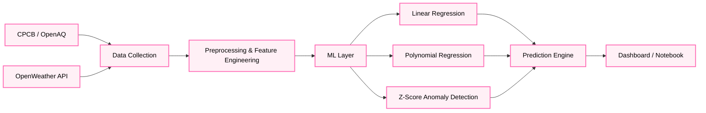

# 🌍 India AQI Dashboard — Project Template

<div align="center">


[](https://developer.mozilla.org/en-US/docs/Web/HTML)
[](https://python.org)
[](https://jupyter.org)
[](https://leafletjs.com)
[](LICENSE)

> ⚠️ **This is a learning template / tutorial project.**
> Follow this guide step by step to build and deploy your own live AQI dashboard with ML capabilities.
> Replace all placeholder values (API keys, sample data) with your own.

**Team Hackovators** · *India Innovates 2026*

</div>

---

## 📖 Table of Contents

1. [What You'll Build](#-what-youll-build)
2. [What You'll Learn](#-what-youll-learn)
3. [Prerequisites](#-prerequisites)
4. [Project Structure](#-project-structure)
5. [Phase 1 — Get Your API Keys](#-phase-1--get-your-api-keys)
6. [Phase 2 — Set Up the Dashboard](#-phase-2--set-up-the-dashboard)
7. [Phase 3 — Collect Real Data](#-phase-3--collect-real-data)
8. [Phase 4 — Run the ML Notebook](#-phase-4--run-the-ml-notebook)
9. [Phase 5 — Deploy to the Web](#-phase-5--deploy-to-the-web)
10. [ML Models Explained](#-ml-models-explained)
11. [AQI Reference](#-aqi-reference)
12. [Troubleshooting](#-troubleshooting)
13. [Team](#-team)

---

## 🏁 What You'll Build

<div align="center">


*A live, interactive AQI map of India with ML-powered forecasting and anomaly detection*

</div>

- 🗺️ **Interactive map** of India showing real-time AQI for 20+ cities
- 📊 **ML models** — Linear Regression, Polynomial Regression, Anomaly Detection
- 🔮 **24-hour AQI forecast** using diurnal pattern modeling
- 🏭 **Pollution source classifier** (vehicles, industry, biomass burning, etc.)
- ⚡ **AI health advisory** per city
- 🌐 **Deployed live** on GitHub Pages — shareable link, no server needed

---

## 🎓 What You'll Learn

| Skill | Tool |
|-------|------|
| Interactive maps in the browser | Leaflet.js |
| Calling government REST APIs | data.gov.in, OpenAQ |
| Data collection & cleaning | Python, pandas |
| ML from scratch | scikit-learn, numpy |
| Data visualization | matplotlib, seaborn |
| Free web deployment | GitHub Pages |

---

## ✅ Prerequisites

Before you start, make sure you have these installed:

```bash
# Check Python version (need 3.8+)
python --version

# Check pip
pip --version

# Check Git
git --version
```

If anything is missing:
- 🐍 Python → https://www.python.org/downloads/
- 🔧 Git → https://git-scm.com/downloads
- 📓 VS Code (recommended editor) → https://code.visualstudio.com/

---

## 📁 Project Structure

```
your-project/
├── index.html           ← Dashboard (open in browser, deploy to GitHub Pages)
├── aqi_ml_models.ipynb  ← All ML models (run in Jupyter)
├── data_template.csv    ← Sample data — replace with your real data
├── fetch_openaq.py      ← Script to pull data from OpenAQ API
├── fetch_weather.py     ← Script to pull weather data from OpenWeather
└── README.md
```

> 💡 **Tip:** Every file has comments explaining what each section does. Read them as you go!

---

## 🔑 Phase 1 — Get Your API Keys

You need **3 free API keys**. This takes about 10 minutes total.

<div align="center">


</div>

### Key 1 — data.gov.in (for the live dashboard map)

1. Go to 👉 https://data.gov.in/user/register
2. Fill in your name, email, and create a password
3. Verify your email
4. Go to your profile → **API Keys** → copy the key
5. It looks like: `579b464db66ec23bdd000001xxxxxxxxxxxxxxxx`

### Key 2 — OpenAQ (for historical pollution data)

1. Go to 👉 https://openaq.org
2. Click **Sign Up** (top right)
3. Verify your email
4. Go to **Account → API Keys → Generate Key**
5. Copy and save it somewhere safe

### Key 3 — OpenWeather (for weather data)

1. Go to 👉 https://openweathermap.org/api
2. Click **Sign Up**
3. After login, go to **API Keys** tab in your profile
4. A default key is already generated — copy it
5. ⚠️ New keys take up to 2 hours to activate

> 🔒 **Never commit real API keys to GitHub.** The template files use placeholder strings — keep it that way until you're ready to use them locally only.

---

## 🖥️ Phase 2 — Set Up the Dashboard

<div align="center">


</div>

### Step 2.1 — Clone or download this project

```bash
# Option A: Clone with Git
git clone https://github.com/YOUR_USERNAME/YOUR_REPO_NAME.git
cd YOUR_REPO_NAME

# Option B: Download ZIP from GitHub → Extract it → Open the folder
```

### Step 2.2 — Add your data.gov.in API key to index.html

Open `index.html` in any text editor (VS Code recommended). Find this line near the bottom:

```javascript
const API_KEY = "YOUR_DATA_GOV_IN_API_KEY"; // Get from https://data.gov.in/user/register
```

Replace `YOUR_DATA_GOV_IN_API_KEY` with your actual key:

```javascript
const API_KEY = "579b464db66ec23bdd000001yourrealkeyhere";
```

### Step 2.3 — Open the dashboard in your browser

Just double-click `index.html` — no server needed!

```
Windows:  double-click index.html
Mac:      open index.html
Linux:    xdg-open index.html
```

You should see the India map with AQI markers. If it shows sample data instead of live data, your API key may need a few minutes to activate.

> 💡 **What you're seeing:** The dashboard calls the CPCB (Central Pollution Control Board) API via data.gov.in and plots live AQI readings on a Leaflet.js map. If the API fails, it falls back to the sample data in `data_template.csv`.

---

## 📡 Phase 3 — Collect Real Data

<div align="center">


</div>

This phase is **optional but recommended** — it gives you a richer dataset for the ML models.

### Step 3.1 — Install Python dependencies

```bash
pip install requests pandas numpy matplotlib scikit-learn seaborn jupyter
```

### Step 3.2 — Fetch pollution data from OpenAQ

Open `fetch_openaq.py` and add your key at the top:

```python
API_KEY = "YOUR_OPENAQ_API_KEY_HERE"  # ← paste your key here
```

Then run it:

```bash
python fetch_openaq.py
```

This creates `openaq_india_data.csv` with columns: `City, Date, PM25, PM10, NO2, SO2, CO, O3`

> 💡 **What's happening:** The script loops through Indian city location IDs on OpenAQ, calls their `/v3/measurements` endpoint for each pollutant, and saves everything to a CSV. You can add more cities by finding their location IDs at https://api.openaq.org/v3/locations?country=IN

### Step 3.3 — Fetch weather data from OpenWeather

Open `fetch_weather.py` and add your key:

```python
OW_API_KEY = "YOUR_OPENWEATHER_API_KEY_HERE"  # ← paste your key here
```

Then run it:

```bash
python fetch_weather.py
```

This creates:
- `weather_current.csv` — current temperature, humidity, wind speed per city
- `weather_forecast.csv` — 5-day forecast data

### Step 3.4 — Use your own data (alternative)

If you already have AQI data (e.g. downloaded from CPCB or Kaggle), format it to match `data_template.csv`:

| Column | Description | Unit |
|--------|-------------|------|
| City | City name | — |
| State | State name | — |
| Date | YYYY-MM-DD | — |
| AQI | Air Quality Index | 0–500 |
| PM2.5 | Fine particulate matter | μg/m³ |
| PM10 | Coarse particulate matter | μg/m³ |
| NO2 | Nitrogen dioxide | μg/m³ |
| SO2 | Sulphur dioxide | μg/m³ |
| CO | Carbon monoxide | mg/m³ |
| O3 | Ozone | μg/m³ |
| NH3 | Ammonia | μg/m³ |
| Station | Monitoring station name | — |

Free datasets to download:
- 🏛️ CPCB official data → https://cpcb.nic.in/
- 🇮🇳 data.gov.in → https://data.gov.in/
- 🌍 OpenAQ → https://openaq.org/
- 📦 Kaggle India AQI → https://www.kaggle.com/datasets/rohanrao/air-quality-data-in-india

---

## 🧠 Phase 4 — Run the ML Notebook

<div align="center">


</div>

### Step 4.1 — Launch Jupyter

```bash
jupyter notebook
```

Your browser will open at `http://localhost:8888`. Click on `aqi_ml_models.ipynb`.

### Step 4.2 — Point the notebook at your data

In **Cell 2**, update the file path to your dataset:

```python
# Change this line:
df = pd.read_csv('data_template.csv', comment='#')

# To your actual file, e.g.:
df = pd.read_csv('openaq_india_data.csv')
```

### Step 4.3 — Run all cells in order

Click **Kernel → Restart & Run All**, or run each cell with `Shift + Enter`.

Here's what each section does:

| Cell | What it does |
|------|-------------|
| 1 | Imports libraries |
| 2 | Loads and cleans your CSV |
| 3 | Plots pollutant distributions |
| 4 | City-wise average AQI bar chart |
| 5 | **Model 1** — Multivariate Linear Regression (PM10 + NO2 → AQI) |
| 6 | Plots actual vs predicted AQI |
| 7 | **Model 2** — Polynomial Regression degree 2 (PM10 → AQI curve) |
| 8 | Plots the polynomial fit curve |
| 9 | **Model 3** — Z-Score Anomaly Detection on AQI history |
| 10 | Plots anomaly spikes on timeline |
| 11 | **Model 4** — Pollution source classification |
| 12 | **Model 5** — 24-hour diurnal AQI forecast |
| 13 | Prints full model performance summary |

### Step 4.4 — Understand the output

After running, you'll see metrics like:

```
=============================================
         MODEL PERFORMANCE SUMMARY
=============================================
Linear Regression   R²=0.847  MAE=±18.3
Polynomial (deg 2)  R²=0.861  MAE=±16.7
Anomalies detected  : 23 / 500 records
Cities analysed     : 20
=============================================
```

- **R²** closer to 1.0 = better model fit
- **MAE** = average prediction error in AQI units
- Try changing features or degree to improve scores!

---

## 🚀 Phase 5 — Deploy to the Web

<div align="center">


</div>

Deploy your dashboard as a **free public URL** using GitHub Pages. No server, no cost.

### Step 5.1 — Create a GitHub account

Go to 👉 https://github.com and sign up if you don't have an account.

### Step 5.2 — Create a new repository

1. Click the **+** icon → **New repository**
2. Name it something like `india-aqi-dashboard`
3. Set it to **Public**
4. Click **Create repository**

### Step 5.3 — Push your project files

```bash
# Inside your project folder:
git init
git add index.html README.md data_template.csv fetch_openaq.py fetch_weather.py aqi_ml_models.ipynb
git commit -m "Initial commit — AQI Dashboard template"
git branch -M main
git remote add origin https://github.com/YOUR_USERNAME/india-aqi-dashboard.git
git push -u origin main
```

> ⚠️ **Important:** Do NOT add files containing real API keys to git. Only push the template versions with placeholder strings.

### Step 5.4 — Enable GitHub Pages

1. Go to your repository on GitHub
2. Click **Settings** (top menu)
3. Scroll down to **Pages** (left sidebar)
4. Under **Source**, select `main` branch → `/ (root)` folder
5. Click **Save**

GitHub will show you a URL like:
```
https://YOUR_USERNAME.github.io/india-aqi-dashboard/
```

It takes **1–2 minutes** to go live. Refresh the page until you see the green "Your site is published" message.

### Step 5.5 — Share your live dashboard! 🎉

Your dashboard is now live at:
```
https://YOUR_USERNAME.github.io/india-aqi-dashboard/
```

Share it with your team, add it to your portfolio, or submit it for the hackathon!

> 💡 **Note on API keys for deployment:** Since `index.html` is public on GitHub Pages, anyone can see your API key in the source code. For a hackathon demo this is usually fine. For a production app, you'd move the API call to a backend server.

---

## 🤖 ML Models Explained

<div align="center">


</div>

### Model 1 — Multivariate Linear Regression

**What it does:** Predicts AQI from PM10 and NO2 readings using the equation:

```
AQI = b0 + b1 × PM10 + b2 × NO2
```

**How it's trained:** Normal equation `(XᵀX)⁻¹Xᵀy` — no gradient descent needed.

**When to use:** When you want a fast, interpretable baseline model.

---

### Model 2 — Polynomial Regression (degree 2)

**What it does:** Fits a curved relationship between PM10 and AQI:

```
AQI = c0 + c1 × PM10 + c2 × PM10²
```

**Why polynomial?** AQI doesn't always scale linearly with PM10 — at high concentrations the relationship curves upward.

**How it's trained:** Gaussian elimination on the expanded feature matrix.

---

### Model 3 — Z-Score Anomaly Detection

**What it does:** Flags unusually high or low AQI readings as anomalies.

```
z = (x − μ) / σ
Flag as anomaly if |z| > 1.8
```

**Use case:** Detect pollution spikes caused by events like crop burning, industrial accidents, or festivals (Diwali).

---

### Model 4 — Pollution Source Classification

**What it does:** Estimates the likely source of pollution based on pollutant ratios:

| Condition | Likely Source |
|-----------|--------------|
| PM10 >> PM2.5 | Construction / Road Dust |
| High NO2 | Vehicular Emissions |
| High SO2 | Industrial Discharge |
| High PM2.5, low NO2 | Biomass / Stubble Burning |
| High NH3 | Agricultural Emissions |

---

### Model 5 — 24-Hour AQI Forecast

**What it does:** Projects AQI for the next 24 hours using a diurnal (daily cycle) pattern:

| Time | Multiplier | Reason |
|------|-----------|--------|
| 07:00–09:00 | ×1.22 | Morning rush hour |
| 17:00–20:00 | ×1.15 | Evening rush hour |
| 00:00–04:00 | ×0.85 | Low traffic, cooler air |
| Other hours | ×1.00 | Baseline |

---

## 🌈 AQI Reference

<div align="center">

| Range | Category | Color | Who's affected |
|-------|----------|-------|----------------|
| 0–50 | 🟢 Good | Green | No impact |
| 51–100 | 🟡 Moderate | Yellow | Very sensitive people |
| 101–150 | 🟠 Unhealthy for Sensitive Groups | Orange | Children, elderly, asthma patients |
| 151–200 | 🔴 Unhealthy | Red | Everyone may feel effects |
| 201–300 | 🟣 Very Unhealthy | Purple | Health warnings for all |
| 301–500 | 🔴 Hazardous | Maroon | Emergency conditions |

</div>

---

## 🏗️ System Architecture



---

## 🔧 Troubleshooting

<details>
<summary><b>❌ Map shows no data / blank markers</b></summary>

- Your data.gov.in API key may not be activated yet — wait 30 minutes and try again
- Open browser DevTools (`F12`) → Console tab — look for any red error messages
- The dashboard will automatically fall back to sample data if the API fails

</details>

<details>
<summary><b>❌ Python script crashes with "ModuleNotFoundError"</b></summary>

Run this to install all dependencies at once:

```bash
pip install requests pandas numpy matplotlib scikit-learn seaborn jupyter
```

</details>

<details>
<summary><b>❌ Jupyter notebook won't open</b></summary>

```bash
# Install jupyter if missing
pip install jupyter

# Then launch
jupyter notebook

# If port 8888 is busy
jupyter notebook --port 8889
```

</details>

<details>
<summary><b>❌ GitHub Pages shows a 404 error</b></summary>

- Make sure your file is named exactly `index.html` (lowercase)
- Check that GitHub Pages is set to deploy from the `main` branch, `/ (root)` folder
- Wait 2–3 minutes after enabling — it takes time to build

</details>

<details>
<summary><b>❌ OpenAQ returns empty data</b></summary>

- Some location IDs may have changed — check current IDs at: https://api.openaq.org/v3/locations?country=IN
- New API keys can take up to 1 hour to activate
- Try running with just one city first to test

</details>

---

## 👥 Team

**Team Hackovators** — *India Innovates 2026*

| Name | Role |
|------|------|
| Aanchal Bhatt | — |
| Aditipriya Dubey | — |
| Shagun Chaudhari | — |

---

## 📄 License

MIT License — free to use, modify, and distribute. See [LICENSE](LICENSE) for details.

---

<div align="center">

Made with ❤️ for India · Data from [CPCB](https://cpcb.nic.in/) · [data.gov.in](https://data.gov.in/) · [OpenAQ](https://openaq.org/)


</div>
